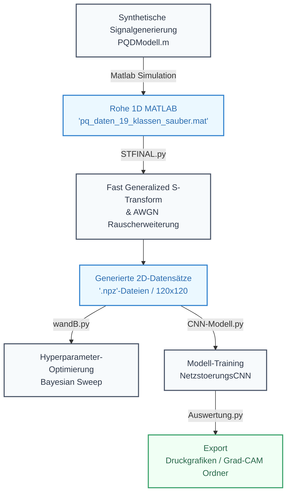
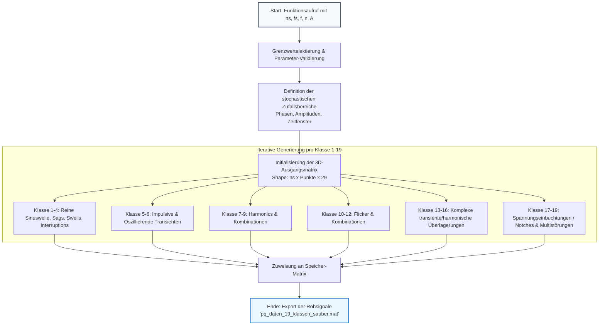
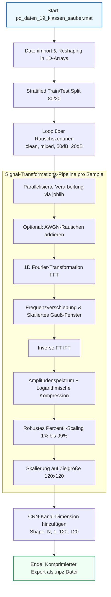
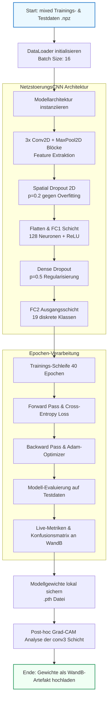
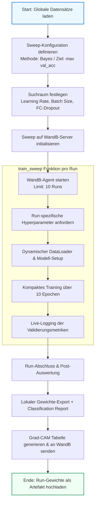
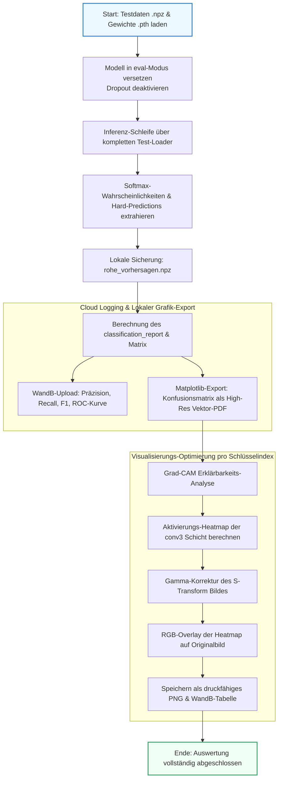

# KI-gestützte Mustererkennung zur Charakterisierung von Netzrückwirkungen beim Laden von Elektrofahrzeugen

Dieses Repository enthält den offiziellen Quellcode für die Forschungsarbeit **"Entwicklung einer KI-gestützten Mustererkennung zur Charakterisierung von Netzrückwirkungen beim Laden von Elektrofahrzeugen"**. 

Das System implementiert eine vollständige Pipeline zur Erkennung, Klassifizierung und Interpretierbarkeit von 19 verschiedenen Klassen von Netzrückwirkungen (Power Quality Disturbances, PQDs). Die Pipeline reicht von der mathematisch-synthetischen Signalgenerierung über die Signalverarbeitung auf Basis der generalisierten S-Transformation und das CNN-Training inklusive Hyperparameter-Optimierung bis hin zur modellinternen Visualisierung mittels Grad-CAM.

---

## 📊 Pipeline-Übersicht



---

## 🛠️ Beschreibung der Skripte

### 1. `PQDModell.m` — Mathematische Signalgenerierung (MATLAB)

Dieses Skript bildet die fundamentale Datenbasis des Projekts. Es implementiert ein integrales mathematisches Modell (basierend auf *Igual et al., 2017*) zur stochastischen Erzeugung von 19 diskreten Netzstörungsklassen.



* **Zentrale Funktionen:**
* **Stochastische Modellierung:** Parameter wie Einbruchstiefe ($\alpha$), Überhöhungsfaktor ($\beta$), Transientendämpfung ($\tau$) oder Notch-Anzahl ($c$) werden innerhalb physikalisch realistischer Grenzen für jedes Signal zufällig gewürfelt.
* **Umfassender Klassenspiegel:** Erzeugt transiente Phänomene, periodische Störungen (Harmonische), Amplitudenschwankungen (Flicker, Sags, Swells) sowie komplexe, in der Praxis auftretende Kombinationsstörungen (z. B. *Harmonics+Swell+Flicker*).
* **Parametrierbarkeit:** Volle Kontrolle über Signalanzahl ($ns$), Abtastrate ($fs$), Netzfrequenz ($f$) und Zyklenanzahl ($n$).
* **Lizenz- & Änderungshinweis:** Modifizierte und übersetzte Version des Originalmodells von 2017, lizenziert unter *Creative Commons Attribution 4.0 International (CC BY 4.0)*.


---

### 2. `STFINAL.py` — Signalverarbeitung & Datensatzgenerierung

Dieses Python-Skript transformiert die stochastisch generierten 1D-Zeitsignale aus MATLAB (`.mat`) mittels fortschrittlicher Zeit-Frequenz-Analyse in hochauflösende 2D-Spektrogramme.



* **Zentrale Funktionen:**
* **Generalized S-Transform (GST):** Berechnet die S-Transformation mit frequenzabhängig skalierter Fensterbreite zur Maximierung der Zeit-Frequenz-Auflösung.
* **Logarithmische Kompression & Perzentil-Skalierung:** Reduziert die Signaldynamik und eliminiert statistische Ausreißer, um Gradienteninstabilitäten beim CNN-Training vorzubeugen.
* **Daten-Augmentation (AWGN):** Beaufschlagt Signale mit additivem weißem gaußschem Rauschen für unterschiedliche Testszenarien (Clean, Mixed 20–50 dB, Feste Pegel bei 20 dB und 50 dB).
* **Parallelisierung:** Nutzt `joblib` für hocheffiziente Multi-Core-Verarbeitung der rechenintensiven Integraltransformationen.


---

### 3. `CNN-Modell.py` — Core Training Pipeline

Dieses Skript definiert die neuronale Netzwerkarchitektur und steuert den primären Trainingsprozess über 40 Epochen auf den rauschbeaufschlagten Spektrogrammdaten.



* **Modell-Architektur (`NetzstoerungsCNN`):**
* Drei aufeinanderfolgende Faltungsblöcke (Conv2D $\rightarrow$ ReLU $\rightarrow$ MaxPool2D) extrahieren raum-zeitliche Muster aus den Spektrogrammen.
* **Spatial Dropout (`Dropout2d`, p=0.2):** Nullt ganze Feature-Maps aus, um Co-Adaptionen der Faltungskerne zu verhindern.
* **Dense Dropout (p=0.5):** Rigide Regularisierung der Klassifikationsschicht gegen strukturelles Auswendiglernen.


* **Zentrale Funktionen:**
* Trainiert das Modell mit dem Adam-Optimizer ($lr=0.0005$) und Cross-Entropy-Verlustfunktion.
* Live-Metriken-Tracking (Loss, Accuracy) und automatische Generierung interaktiver Konfusionsmatrizen pro Epoche in **Weights & Biases (WandB)**.


---

### 4. `wandB.py` — Hyperparameter-Sweep (Optimierung)

Zur systematischen Maximierung der Modellperformance implementiert dieses Skript eine automatisierte, bayesianische Hyperparameter-Suche.



* **Zentrale Funktionen:**
* **Bayesianische Optimierung:** Durchsucht den vordefinierten Suchraum intelligent auf Basis vorheriger Läufe, um die Validierungsgenauigkeit (`val_acc`) effizient zu maximieren.
* **Dynamische Konfiguration:** Steuert Variablen wie Lernrate ($0.001, 0.0005, 0.0001$), Batch-Size ($16, 32, 64$) und den FC-Dropout-Faktor ($0.3, 0.4, 0.5, 0.6$) direkt über den cloudbasierten WandB-Agenten.


---

### 5. `Auswertung.py` — Standalone Inferenz & Druckgrafik-Export

Dieses Skript dient der finalen Validierung trainierter Modelle auf unabhängigen Test-Szenarien und erzeugt hochauflösende Visualisierungen für die schriftliche Ausarbeitung.



* **Zentrale Funktionen:**
* **High-Res Vektor-Export:** Generiert eine druckreife, hochauflösende PDF der Konfusionsmatrix (`Konfusionsmatrix_Druckqualitaet.pdf`) im passenden wissenschaftlichen Farbschema (`Blues`).
* **Optimiertes Grad-CAM Visualisierungs-System:** Berechnet Aktivierungs-Heatmaps der letzten Faltungsschicht (`conv3`) für dedizierte Schlüsselindizes. Wendet eine **Gamma-Korrektur** ($\gamma = 0.5$) auf das S-Transformationsbild an, um feine, schwache Frequenzkomponenten für das menschliche Auge im finalen PNG-Overlay sichtbar zu machen.


---

## 📋 Voraussetzungen & Installation

Das Projekt basiert auf **PyTorch** und nutzt **CUDA** zur Hardwarebeschleunigung auf NVIDIA-GPUs (getestet mit PyTorch 2.6.0 und CUDA 12.4).

### Abhängigkeiten installieren:

```bash
pip install torch torchvision --index-url [https://download.pytorch.org/whl/cu124](https://download.pytorch.org/whl/cu124)
pip install numpy scipy scikit-image scikit-learn matplotlib joblib h5py wandb pytorch-grad-cam

```

```

```
